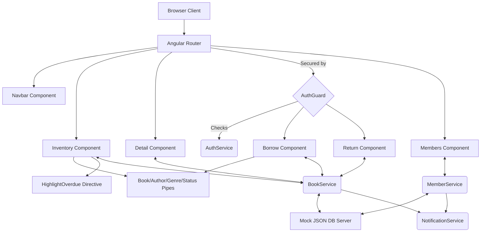

# The King's Archive: Library Management System

A majestic, high-performance Library Management System built with Angular 17+ and TypeScript, featuring a luxurious "Royal Vibe" aesthetic inspired by a King's Library.

## 🏰 Features

- **Royal Archive Inventory**: Browse available tomes with advanced filtering and pagination.
- **Detailed Scrutiny**: View individual book details with archival value (pricing) and circulation status.
- **Royal Requisitions**: Requisition books using Reactive Forms with validation.
- **Guild of Members**: Manage library records and membership enlistment.
- **Archival Security**: Guarded routes ensuring only authorized members can claim or restore tomes.
- **Responsive Gilding**: A mobile-optimized interface with parchment textures, gold accents, and smooth cinematic transitions.

## 🛠️ Technology Stack

- **Framework**: Angular (Latest)
- **Language**: TypeScript
- **Styling**: Vanilla CSS with Royal Color Tokens & Google Fonts (Cinzel, Playfair Display)
- **UI Components**: Angular Material (MatTable, MatCard, MatPaginator, MatSnackBar, etc.)
- **Data Source**: Mock JSON Server

## 📜 Setup Guide

1. **Install Dependencies**:
   ```bash
   npm install
   ```

2. **Start Mock Server**:
   ```bash
   npm run server
   ```

3. **Launch the Archive**:
   ```bash
   ng serve
   ```
   *The archive will be accessible at `http://localhost:4200`.*

## 📐 Architecture

- **Standalone Components**: Modular and efficient architecture.
- **Global Interceptors**: Robust HTTP error handling and loading feedback.
- **Reactive State**: Using Observables for seamless data flow.
- **Custom Directives**: Highlights overdue tomes with archival significance.
- **Custom Pipes**: Sophisticated categorical filtering across Titles, Authors, Genres, and Availability.

### System Diagram



---
*Created for the Royal Archive Restoration Project.*
