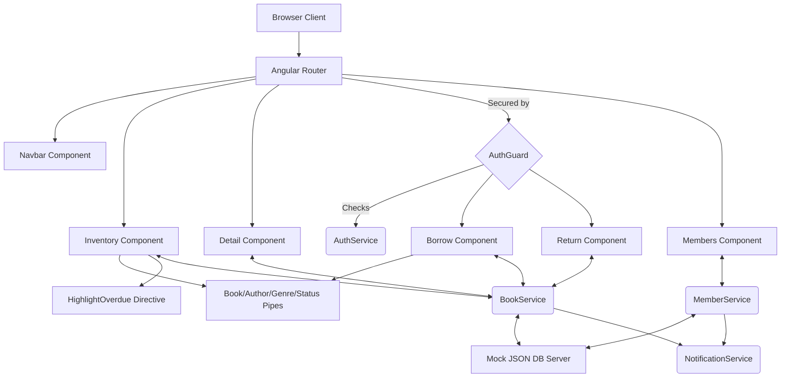

# 👑 The King's Archive: Library Management System

A breathtaking, premium **SaaS-style Royal Library Management System** crafted with **Angular 17+** and **TypeScript**. This project demonstrates an advanced mastery of Angular architecture, reactive programming, robust data modeling, and stunning UI/UX design featuring custom parchment textures, dark wood backgrounds, gold accents, and a highly polished royal color palette.

---

## 👨‍💻 Team Details
Meet the developers behind this masterpiece:
- **PULI BALAJI YASHWANTH REDDY**
- **JINS THOMAS**
- **ANUSHKA PRAVAKAR**
- **NEVITA SHARON Y**

---

## 🏗️ Architecture Overview
The application is structured into modular components guided by Angular's dependency injection system, managing state via RxJS Observables attached to an external JSON server API.



---

## 🎯 Key Features & UX
### 1. Angular Fundamentals & Architecture
- **Strict Data Modeling**: Powered by robust `Book`, `Member`, and `Transaction` interfaces.
- **Service-Oriented Architecture**: `BookService` and `MemberService` handle all business logic, HTTP communication, and Dependency Injection across components.
- **Smart Routing**: Incorporates dynamic route parameters to load specific book details (`/book/:id`), alongside Route Guards (`AuthGuard`) protecting additive and transactional routes.

### 2. Premium Design System (Royal Vibe)
- **Immersive Textures**: Frosted card components utilizing deep dark wood backdrops and ancient parchment surfaces.
- **Top-Tier Typography**: Beautiful contrast driven by 'Cinzel' and 'Playfair Display' Google Fonts paired with Material Symbols.
- **Micro-Animations**: Smooth hover transitions, floating navbar elements, and rich visual feedback using the Material Snackbar system.

### 3. Advanced Dynamic Controls
- **Interactive Directory**: A robust `MatTable` featuring a "Royal Filter Block" with instant Search filtering, Author/Genre isolation, and interactive Status toggles.
- **High-Performance Rendering**: Components are boosted by `ChangeDetectionStrategy.OnPush` to guarantee lighting fast UI updates.
- **Custom Directives & Pipes**: An `[appHighlightOverdue]` directive highlights critical tomes, while specific categorical pipes (`AuthorFilterPipe`, `GenreFilterPipe`, `StatusFilterPipe`) handle granular search algorithms entirely on the frontend.
- **Form Excellence**: Highly responsive additive forms featuring comprehensive validation rules, real-time error messages, and elegant input fields.

---

## 💻 Tech Stack
| Category     | Technology          |
|--------------|---------------------|
| **Core** | Angular 17+, TypeScript |
| **Styling**   | Custom CSS3, Angular Material |
| **Logic** | RxJS, Reactive Forms, HttpClient, Signals & Observables |
| **Backend API** | Mock JSON Server |
| **Environment** | Node.js, Angular CLI |

---

## 🚀 Local Installation & Setup

You will need to run two terminal processes simultaneously to launch this application fully: one for the Mock Backend Database, and one for the Angular Frontend.

### **Phase 1: Backend Setup (JSON Server)**
1. **Navigate to the project directory**
   ```bash
   cd library-management-angular
   ```
2. **Install global JSON server** (If not already installed)
   ```bash
   npm install -g json-server
   ```
3. **Start the database server**
   ```bash
   npm run server
   ```
   *The mock API will now be listening for CRUD operations on port `3000`.*

### **Phase 2: Frontend Setup (Angular)**
1. **Open a new (second) terminal window** in the same project directory.
2. **Install all Angular dependencies**
   ```bash
   npm install
   ```
3. **Start the Angular Development Server**
   ```bash
   ng serve -o
   ```
   *The application will compile and automatically open in your default browser at `http://localhost:4200/`.*
